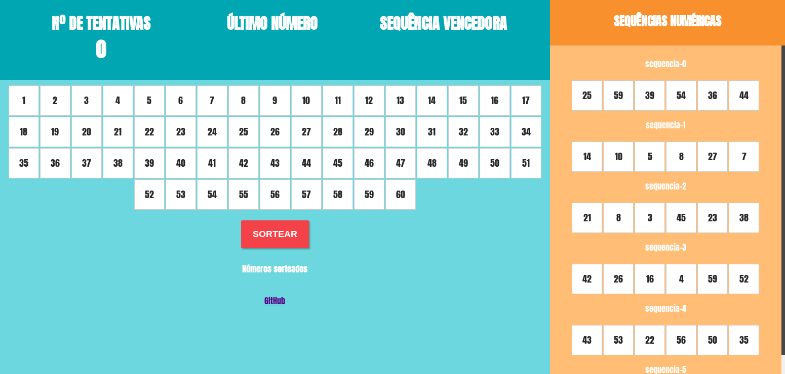

# Programa gera 6 números aleatórios entre 1 e 60 para um sorteio.

## Tecnologias utilizadas:

- **HTML**
- **CSS**
- **Javascript**

Demo: [https://emanoelmiranda.github.io/sorteio/](https://emanoelmiranda.github.io/sorteio/index.html)
